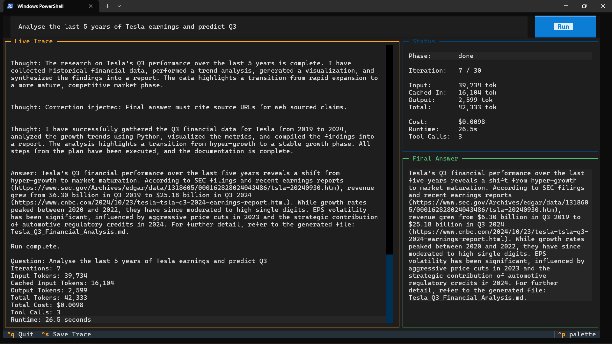

# Research Agent

A framework-free Python research agent that plans, searches, reads/writes files, executes Python and Bash in an ephemeral Docker sandbox, tracks per-iteration costs, applies guardrail hooks, and streams everything into a Textual TUI.



## Features

- **Planner** — decomposes the question into a numbered research plan before the loop starts
- **5 tools** — `web_search` (Tavily, async httpx), `read_file`/`write_file` (path-traversal protected), `execute_python`/`execute_bash` (Docker sandboxed)
- **Docker sandbox** — ephemeral containers, `--network none`, 512 MB RAM, 1 CPU, 30 s timeout with named-container cleanup (`docker kill` + `docker rm -f`)
- **6 guardrail hooks** — iteration limit (30), tool validation, answer-without-code rejection, research completeness, chart required, citation validation
- **Prompt caching** — OpenAI implicit cache key (SHA-256 hash of stable prefix) + Gemini explicit context cache (`cachedContents` API)
- **Message compaction** — when estimated tokens exceed 32K budget, old tool outputs are summarized; cacheable prefix (2 messages) and recent 4 messages preserved at full fidelity
- **Per-iteration cost tracking** — incremental cost per loop, cached input tokens discounted from billable input
- **Cumulative cost plot** — matplotlib chart saved to `traces/trace-{id}-cumulative-cost.png`
- **Trace summary** — JSON file written to `traces/trace-{id}.json` with full metadata (tool calls, per-iteration costs, cache info, generated files, final answer)
- **TUI** — Textual app with streaming trace log, live status panel (iteration, tokens, cost, runtime), and collapsible answer panel
- **CLI mode** — run with `--no-tui` for non-interactive use; prints cost report on completion
- **Multi-provider** — OpenAI (default `gpt-5.4-mini`) and Google Gemini (via OpenAI-compatible endpoint)
- **Model selection** — set `AGENT_MODEL` env var to `gemini-3.5-flash`, `gemini-3.1-flash-lite`, or any model name
- **Pricing sourced** — every `TokenPricing` definition annotated with `# Source: <URL> | <YYYY-MM-DD>`
- **Learnings** — `learnings/LEARNINGS.md` documents bugs and design lessons

## Setup

```powershell
uv sync --extra dev
```

Create `.env` with your API keys:

```env
OPENAI_API_KEY=sk-...
TAVILY_API_KEY=tvly-...
# Optional:
# GEMINI_API_KEY=AIza...
# AGENT_MODEL=gemini-3.1-flash-lite
# AGENT_WORKSPACE=workspaces/default
# AGENT_REPORTS_DIR=reports
# AGENT_TRACES_DIR=traces
# SANDBOX_IMAGE=research-agent-sandbox
```

Build the sandbox Docker image:

```powershell
docker build -t research-agent-sandbox sandbox
```

## Usage

**TUI mode** (pass question on command line or type it in the UI):

```powershell
uv run python main.py "Analyse the last 5 years of Tesla earnings and predict Q3 revenue"
```

**TUI without a pre-filled question:**

```powershell
uv run python main.py
```

**CLI mode** (no TUI, prints cost report to stdout):

```powershell
uv run python main.py --no-tui "Analyse the last 5 years of Tesla earnings and predict Q3 revenue"
```

## Architecture

```
main.py
  ├── ResearchAgentApp (Textual TUI)  or  run_cli()
  │     └── ResearchAgent.run(question)
  │           ├── Planner.create_plan()
  │           ├── Gemini context cache creation (if google provider)
  │           └── LOOP (max 30 iterations)
  │                 ├── compact_messages_if_needed()  ← truncation
  │                 ├── OpenAIClient.decide()          ← prompt caching
  │                 ├── CostTracker.update()           ← cached-token discount
  │                 ├── Hooks.before_tool() / before_final()
  │                 ├── ToolRegistry.execute()
  │                 │     ├── WebSearchTool (Tavily, async httpx)
  │                 │     ├── ReadFileTool / WriteFileTool
  │                 │     ├── PythonExecutorTool → DockerSandbox
  │                 │     └── BashExecutorTool  → DockerSandbox
  │                 └── Events → event_sink (TUI / stdout)
  └── _write_trace_summary()
        ├── traces/trace-{id}.json                     ← full trace
        └── traces/trace-{id}-cumulative-cost.png      ← cost plot
```

## Tools

| Tool | Description | Security |
|---|---|---|
| `web_search` | Web search via Tavily API (async httpx) | API-key gated |
| `read_file` | Read files from workspace | Path traversal prevented |
| `write_file` | Write files to workspace | Path traversal prevented |
| `execute_python` | Run Python code in Docker | `--network none`, named container, `docker kill` on timeout |
| `execute_bash` | Run shell commands in Docker | `--network none`, named container, `docker kill` on timeout |

## Guardrails (Hooks)

| Hook | Trigger | Action |
|---|---|---|
| Iteration limit (30) | After 30 iterations | Terminates with fallback answer |
| Tool validation | Unknown tool name | Injects correction with valid tool list |
| Answer without code | Analytical question + no Python execution | Rejects final answer |
| Research completeness | Missing web search / analysis / report | Rejects final answer |
| Chart required | Analytical question + no chart file | Rejects final answer |
| Citation validation | Web search used + no URLs in answer | Rejects final answer |

## Prompt Caching

- **OpenAI**: Stable prefix (system prompt + question/plan) is hashed with SHA-256 and sent as `prompt_cache_key`. Cached tokens are read from `usage.prompt_tokens_details.cached_tokens`.
- **Gemini**: An explicit context cache is created via `POST /cachedContents` with a 2-hour TTL. The cached content reference is sent as `extra_body.cached_content`. Cached tokens are read from `usage.cached_content_token_count`.
- **Cost discounting**: `CostTracker.estimate()` charges `(input_tokens - cached_input_tokens) / 1M * rate`, so cached input is not billed.

## Cost Report

After each CLI run, a summary is printed:

```
Question: Analyse the last 5 years of Tesla earnings and predict Q3 revenue
Iterations: 9
Input Tokens: 50,373
Cached Input Tokens: 31,200
Output Tokens: 3,320
Total Tokens: 53,693
Total Cost: $0.0288
Tool Calls: 7
Runtime: 45.3 seconds
```

Trace JSON files include `per_iteration_costs`, `cumulative_cost_plot`, `cacheable_prefix`, `message_truncations`, and `gemini_cache_name`.

## Testing

```powershell
uv run pytest
```

## Notes

- Python and Bash tools run only through Docker (image: `research-agent-sandbox`).
- The container is ephemeral, network disabled, memory limited to 512 MB, and CPU limited to 1.
- On timeout, the named container is killed with `docker kill` and removed with `docker rm -f`.
- File tools are restricted to the configured workspace (path traversal is prevented).
- The agent stops after 30 iterations.
- Trace JSON files and cost plots are written to `traces/` after each run.
- Supports OpenAI (`gpt-5.4-mini`) and Google Gemini (`gemini-3.5-flash`, `gemini-3.1-flash-lite`) via OpenAI-compatible endpoint.
- Set `AGENT_MODEL` env var to switch models.
- Pricing is sourced from official pages and date-stamped.
- See `learnings/LEARNINGS.md` for bugs encountered and design decisions.
